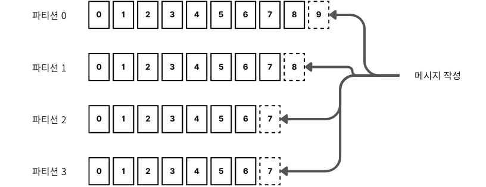

## 카프카 기본

### 메시지와 배치

- 메시지는 데이터의 기본 단위 데이터베이스의 레코드와 비슷
- 카프카는 효율성을 위해 메시지를 배치 단위로 저장 
- 배치 토픽의 파티션에 쓰여지는 메시지들의 집합

### 토픽과 파티션

- 카프카에 저장되는 메시지는 토픽 단위로 분류 파일 시스템의 폴더와 비슷한 개념

- 커밋로그 관점에서 파티션은 하나의 로그 파티션에 미시지가 쓰여질 떄는 추가만 간으하다

- 메시지는 단일 파티션 안에서만 순서가 보장

- 하나의 토픽의 저장된 데이터를 스트림라고도 표현

  

### 프로듀서와 컨슈머

